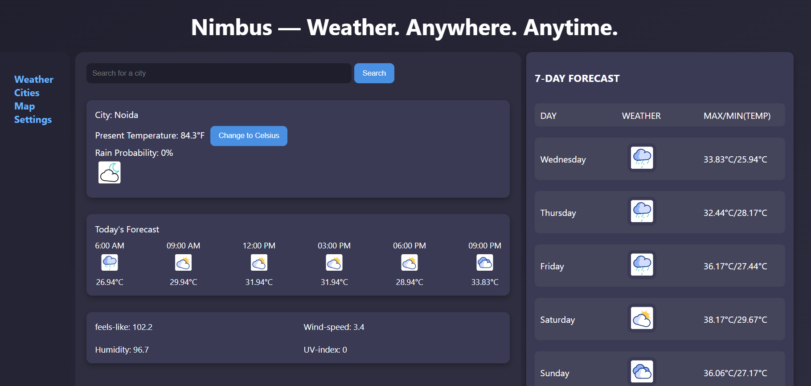

# 🌤️ Nimbus — A Modern Weather Web App

**Nimbus** is a sleek, animated weather forecasting web application that provides real-time temperature, rain probability, and both hourly and 7-day forecasts for any city worldwide. Built with vanilla JavaScript, HTML, and CSS, Nimbus offers an intuitive UI and a seamless weather-checking experience.


---

## 📸 Preview



---

## ✨ Features

- 🌍 **Search Any City** – Fetch real-time weather by entering a city name.
- 🌡️ **Current Temperature** – See temperature in Fahrenheit or switch to Celsius.
- 🕒 **Hourly Forecast** – Displays temperature and animated weather icons for the next 6 time slots.
- 📆 **7-Day Forecast** – Get a glance at the weather trend with min/max temperatures.
- 🌦️ **Animated Icons** – Clean, modern animated weather visuals.
- 📱 **Responsive Design** – Optimized for desktop and adaptable for smaller screens.

---

## 🛠️ Tech Stack

- **HTML5**
- **CSS3**
- **JavaScript (ES6+)**
- **Visual Crossing Weather API**

---

## 📦 Getting Started

1. **Clone the Repository**
   ```bash
   git clone https://github.com/your-username/nimbus-weather-app.git
   cd nimbus-weather-app

 2. **Open in Browser**

   Open index.html in your preferred browser.

⚠️ You’ll need a valid API key from Visual Crossing to fetch weather data.

 
## API Used
Visual Crossing Weather API
Provides weather forecasts and historical data for any location worldwide.